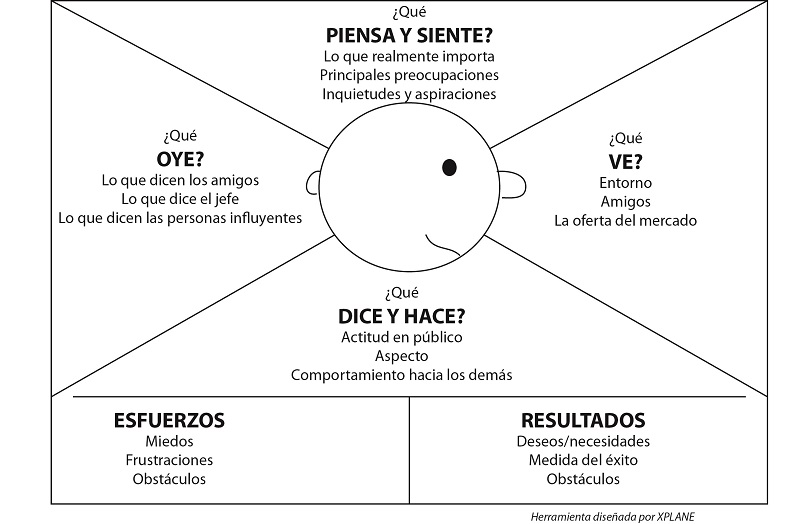
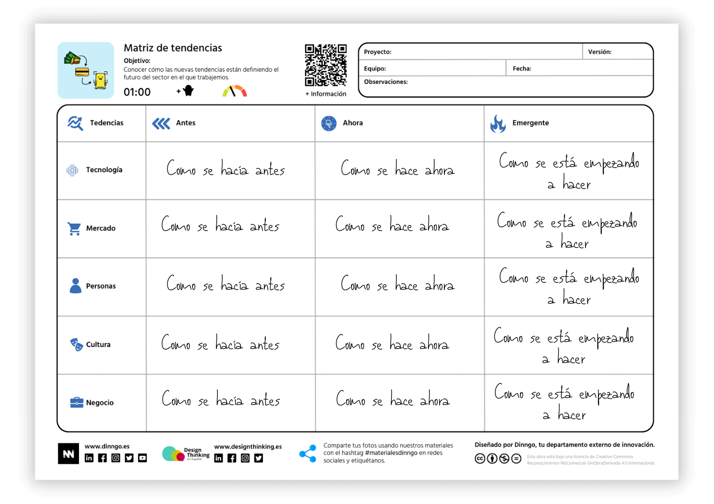
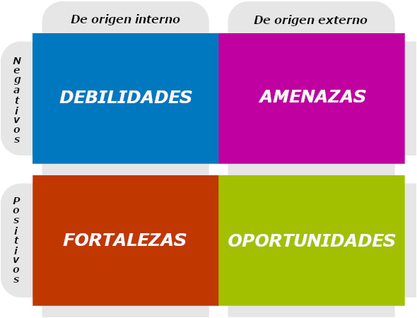
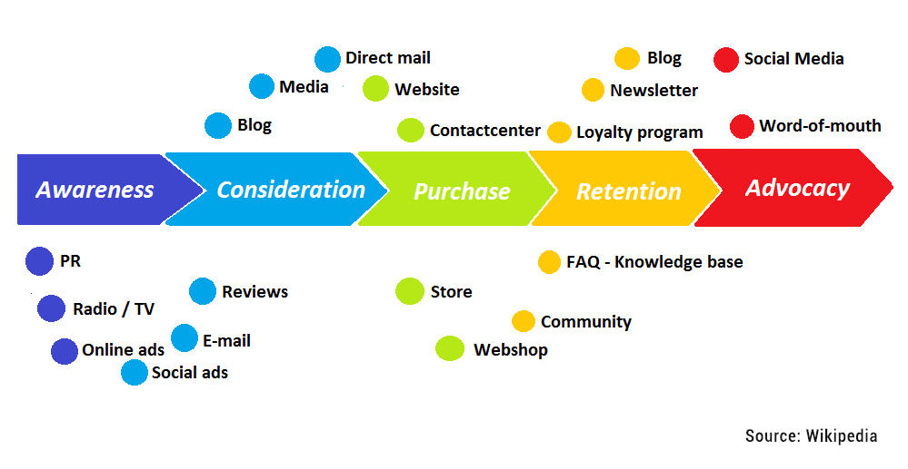

Un tercio de las organizaciones fracasa por ofrecer productos que nadie necesita o utiliza. El Design Thinking es un ciclo contínuo que alterna etapas de pensamiento divergente (creación de múltiples opciones) con otras de pensamiento convergente (filtrado de opciones) en el que se repiten las siguientes fases:
- **Empatizar**: Entender a fondo a los usuarios - divergente
- **Definir el problema**: Formular el problema desde la prespectiva del usuario - convergente
- **Idear la solución**: Generar ideas creativas y valiosas - divergente
- **Prototipar**: Tangibilizar las ideas para probarlas - convergente
- **Validar**: Verificar la efectividad de las soluciones con los usuarios - convergente

# 1. Empatizar con los Usuarios
## 1.1. Qué? Objetivo
Un caso de uso es observar que la generación Z tiene conciencia medioambiental pero no separan los residuos que generan. Podemos pensar que les falta información o motivación para hacerlo, pero no estaremos seguros. La fase de empatía permite profundizar en las verdaderas razones.

La empatía no consiste únicamente en datos demográficos (edad, género, estudios, ubicación, etc.), sino en comprender su mentalidad, frustraciones, deseos

## 1.2. Cómo? Instrumentos - 4:07
Para recopilar información podemos usar los siguientes instrumentos:
- **Observación directa** e indirecta (redes sociales, etc.), Permite reconocer patrones de los que los usuarios no son conscientes o que no compartirían en una entrevista.
- Las **etrevistas** permiten profundizar en los usuarios, idealmente con preguntas abiertas sobre sus sentimientos y dificultades.
- Informes y estudios económicos, demográficos, culturales, sociales, etc pueden dar mucha información sobre la realidad de la situación
- El **mapa de empatía** permite descubrir cómo piensta, siente y se comportan los usuarios. También pueden resaltar incongruencias entre lo que los usuarios dicen y lo que verdaderamente hacen, lo que puede darnos pistas sobre cómo solucionarlo.

Por ejemplo, si alguien ya está concienciado sobre el medio ambiente pero cree que los deshechos reciclados se mezclan, no tiene sentido hacer cursos de concienciación, pero sí campañas de información sobre el proceso de reciclado.

## 1.3. Para qué? Resultados - 8.28
Tras recopilar y analizar la información, es clave crear un “arquetipo” o un “buyer persona” que defina el perfil objetivo de nuestro producto o servicio.

# 2. Definir el Problema
## 2.1. Qué? Objetivo
Consiste en procesar todo lo que hemos aprendido para definir el problema clave a resolver. No debemos enamorarnos ni centrarnos en la solución que queremos proponer, si no centrarnos en el problema, en los que frustra al usuario y lo que le satisface. Así será mucho más fácil proponer soluciones.

## 2.2. Cómo? Instrumentos - 2:57
Algunas de las herramientas más utilizadas son:

La **matriz de tendencias** ordena tendencias culturales, sociales y económicas del usuario. Permite visualizar el cambio en diferentes campos:

El **DAFO** permite analizar los elementos internos (de la solución) y externos (del entorno del usuario):

El **Customer Journey** permite visualizar todo el recorrido de un usuario al interactuar con un producto o servicio. Permite detectar puntos de dolor y satisfacción a lo largo del camino:

## 2.2.3. Para qué? Resultados - 5:53
Tras haber identificado todos los pains y los gains de los usuarios, es posible formular el desafío a resolver. Es importante hacerlo de forma abierta para permitir el desarrollo de distintas soluciones. Una forma de hacerlo es usar la pregunta “Cómo podríamos + beneficio + beneficiaro?”. Por ejemplo: “Cómo podríamos mejorar la experiencia de reciclaje en jóvenes GenZ preocupados por el medio ambiente?”.

# 3. Idear la solución
## 3.1. Qué? Objetivo
Una vez los usuarios están definidos y comprendidos y hemos logrado definir claramente el problema a resolver, vamos a ver cómo solucionar dicho problema.

Debemos generar ideas sin restricciones ni criticas para fomentar la creatividad y la libertad. Luego las filtraremos para quedarnos con aquellas con mayor potencial. La cantidad prima sobre la calidad en esta fase.

Suele ser mejor centrarse en unos pocos pains y gains pero que sean extremos para el usuario.

## 3.2. Cómo? Instrumentos - 2:55
Técnicas para hacer esto incluyen:
- Brainstorming o lluvia de ideas es muy útil. Para fomentar la participación de personas más tímidas se puede hacer “brainwriting”, escribiendo las ideas en vez de diciéndolas en voz alta.
- Técnica SCAMPER permite refinar ideas a través de una serie de preguntas, como sustituir, combinar, adaptar, modificar, proponer otros usos, eliminar o reorganizar elementos de una idea.
- Seis sombreros de Bono permite analizar una idea desde distintas perspectivas, una por sombrero; Lógica, emocional, creativa, crítica, optimista y de control.

Para seleccionar las mejores ideas existen instrumentos como;
- Modelo DVF: Una buena solución debe ser deseable (se necesita), factible (se puede hacer) y viable (se puede financiar).

## 3.3. Para qué? Resultados - 7:21
El resultado clave es desarrollar una propuesta de valor, resaltando cómo nuestra solución crea valor y cómo resuelve el problema del usuario.

# 4. Prototipar la Solución
## 4.1. Qué? Objetivo
Una vez hemos propuesto varias ideas y hemos seleccionado una o varias con más potencial, es necesario prototipar para probar si nuestras hipótesis resuelven el problema. Un prototipo permite incorporar el feedback de los usuarios y ajustar la solución antes de hacer un desarrollo completo.

Los prototipos deben ser baratos y rápidos de hacer. La idea es fallar rápido y barato, cometiendo la máxima cantidad de errores lo antes posible antes de invertir demasiado tiempo y dinero.

## 4.2. Cómo? Instrumentos - 2:40
Ilustraciones, bocetos o artefactos suelen ser muy útiles para representar gráfica o físicamente una idea.

Los cómics o story board pueden mostrar cómo se usaría el producto de principio a fin.

Mockups de aplicaciones o webs pueden ser muy útiles para dar una impresión profesional y más cercana a cómo sería utilizar la solución final.

## 4.3. Para qué? Resultados - 6:14
El resultado de esta fase es un prototipo que permita obtener feedback de usuarios finales, penar más en profundidad sobre la solución para detectar potenciales problemas. Eventualmente, los prototipos deberían llevarnos a un MVP (Producto Mínimo Viable), una versión funcional de nuestra solución con sus características esenciales pero que permite testear el prototipo en condiciones reales.

Es posible lanzar el MVP a mercado para evaluar su impacto y continuar refinándolo en producción.

# 5. Validar la Solución
## 5.1. Qué? Objetivo
Tras hacer varios prototipos, pudimos recopilar impresiones de usuarios finales. En esta fase pondremos esos prototipos (ya refinados) a prueba. Esto permite o seguir refinando el prototipo o pivotar hacia otra solución.

El objetivo es presentar una solución a usuarios reales y utilizar sus impresiones para fortalecer la solución o para rechazarla y pivotar hacia otra dirección.

## 5.2. Cómo? Instrumentos - 3:47
- Entrevistas cara a cara con usuarios reales con preguntas abiertas (qué les gusta, qué mejorarías, etc.). También pueden utilizarse encuestas o formularios.
- Los relatos y el storytelling ayudan al usuario a entender el producto y conectar con él. Permite mostrar cómo la solución resuelve los problemas.
- Se pueden hacer pruebas de usabilidad para ver cómo los usuarios interactúan con tu producto en tiempo real. Esto puede mostrar problemas de intuitividad u organización. También permite medir cuánto tiempo les lleva realizar ciertas acciones.

Es esencial recordar que el Design Thinking es una metodología iterativa. Deben hacerse varias pruebas de la solución, no se debe esperar a tener la solución perfecta.

## 5.3. Para qué? Resultados - 6:57
El resultado clave es si la solución resuelve o no los problemas del usuario y cómo el usuario interactúa con la solución. Esto permite continuar desarrollando la solucion, mejorándola e iterando más adelante o, si el feedback es negativo, modificar la solución o directamente pivotar hacia otra vía.
