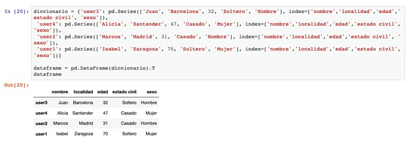

# Análisis de Datos

## 1. Introducción
En este tema, describiremos las principales funcionalidades de los dos módulos más importantes para manejar datos en Python: `NumPy` y `Pandas`. Esto incluirá:
- Estructuras de datos básicas de `NumPy`: *arrays* y *matrices*.
- Fnciones universales y estadísticas en `NumPy`.
- Conocer las estructuras de datos básicas de `Pandas`: *series* y *dataframes*.
- Funciones de filtrado en las estructuras de `Pandas`.
- unciones estadísticas en `Pandas`.
- Modificar los valores almacenados en las estructuras de datos de `Pandas`. 


## 2. NumPy
Es un módulo de Python orientado a librerías científicas. Proporciona nuevas estructuras de datos y métodos para trabajar con ellas.

### 2.1. Arrays y Matrices
Los ***arrays*** almacenan una secuencia de valores del mismo tipo. Muy similares a las listas de Python, pero más rápidos si se utiliza el mismo tipo en sus elementos. También utilizan bloques contiguos de memoria, lo que les hace más eficientes. Es posible utilizar tipos distintos, pero sus métodos pueden dar errores. Podemos crear un *array* haciendo `array = np.array([1, 2, 3, 4])`. Para acceder al segundo elemento, usamos índices (igual que con las listas de Python), como `array[2]`, que devolvería `3`. También podemos especificar el tipo de datos utilizando el argumento `dtype` o crear arrays vacíos o llenos de ceros o unos con `np.empty()`, `np.zeros()` o `np.ones()`, respectivamente. Otra opción es usar algo como `np.full(5, 7)` para crear un array con cinco sietes.

Las ***matrices***  son *arrays* con más dimensiones, aunque lo más común es que tenga dos. Se inicializan (y se comportan) como si fuesen listas de listas: `matriz = np.array([[1, 2, 3], [4, 5, 6]])`. **IMPORTANTE**: Si todas las filas NO tienen la misma longitud, se creará un array de listas en vez de una matriz. Si queremos crear matrices identidad, podemos utilizar `np.eye(3)`, que creará una matriz identidad 3x3. Para matrices diagonales, existe `np.diag()`.

Si comparamos la memoria que ocupa una lista y un array de o el tiempo que se tarda en realizar operaciones con ellos, vemos la diferencia en eficiencia:

```python
import numpy as np
import sys

lista = range(1000)
array = np.array(range(1000))

# Espacio ocupado por la lista y por el array
print(sys.getsizeof(1) * len(lista))  # 28000
print(array.size * array.itemsize)  # 8000 -> Menos del 30% que la lista
```

```python
import time

n_elementos = 1000000  # 1 millón
lista1 = range(n_elementos)
lista2 = range(n_elementos)
array1 = np.array(range(n_elementos))
array2 = np.array(range(n_elementos))

# Tiempo de restar los elementos de dos listas
comienzo = time.time()
resultado = [x - y for x, y in zip(lista1, lista2)]
final = time.time()
print(final - comienzo)  # 0.080843

# Tiempo de restar los elementos de dos arrays
comienzo = time.time()
resultado = [x - y for x, y in zip(array1, array2)]
final = time.time()
print(final - comienzo)  # 0.005764 -> Menos del 10% que con listas
```

Otra función útil de NumPy es la función `np.arange()`, que funciona igual que la `range()` nativa de Python, pero devuelve NumPy arrays y permite usar decimales. `np.linspace()` es parecida, pero en lugar de especificar el paso, se elige cuántos elementos queremos generar (muy útil para generar coordenadas). `np.logspace()` es igual pero generará muestras logarítmicas.

Con `np.random.random()` generamos números aleatorios entre 0 y 1. También podemos configurar un **generador de estructuras aleatorias** con `rng = np.random.default_rng(seed)`. Una vez creado, esto permite generar conjuntos:
- `rng.random(5)`: Array de 5 números aleatorios entre 0 y 1.
- `rng.random((2, 3))`: Matriz de 2 filas y 3 columnas con números aleatorios entre 0 y 1.
- `rng.uniform(10, 20, size=5)`: Array de 5 números float aleatorios entre 10 y 20.
- `rng.integers(1, 7, size=10)`: Array de 10 números enteros aleatorios entre 1 y 7.
- `rng.uniform(-10, 10, size=(100, 2))`: Matriz de 100 filas y 2 columnas con números float aleatorios entre -10 y 10.
- `rng.normal(size=5)`: Array de 5 números aleatorios sampleados con probabilidad gaussiana (media 0 y desviación 1).
- `rng.normal(loc=100, scale=15, size=10)`: Array de 10 números aleatorios sampleados con probabilidad gaussiana (media 100 y desviación 15).
- Otras distribuciones, como binomial, de poisson, exponencial, multivariante, etc.

También es posible seleccionar N elementos aleatorios de un array con `rng.choice(elementos, size=n_elecciones)` (añadir `replace=False` para que cada elemento se elija una única vez) o permutaciones con `rng.permutation(elementos)`. También puedes hacer `rng.shuffle(elementos)` para modificar `elementos` directamente, sin crear un nuevo array.

Algunos **atributos importantes** a conocer son:
- `array.shape`: Tupla con la forma del array. Para 1D será algo como `(5,)` (5 elementos), para 2D `(3, 2)` (3 filas y 2 columnas), para 3D `(4, 3, 2)` (4 *bloques* de 3 filas y 2 columnas cada uno), etc.
- `array.ndim`: Número de dimensiones del array.
- `array.size`: Número de elementos en el array, independientemente de su estructura. Tanto un array unidimensional con 4 elementos como una matriz 2x2 devolverán 4.
- `array.dtype`: Tipo de los elementos del array (uint8, int16, int64, float64, bool, etc.).
- `array.itemsize`: Tamaño en bytes de cada elemento del array.
- `array.nbytes`: Tamaño en bytes de todo el array. Es equivalente a hacer `array.itemsize * array.size`.
- `matrix.T`: Devuelve la matriz transpuesta, haciendo que las columnas sean las nuevas filas y viceversa.

Como último detalle, es posible utilizar **indexación booleana**, lo que permite aplicar filtros de forma muy rápida. Consiste en algo así: `datos_filtrados = datos[datos < 10]`, lo que construiría un array `datos_filtrados` sólo con aquellos datos inferiores a 10. Dado que se puede utilizar sin necesidad de crear un nuevo array (por ejemplo, como generador en un bucle `for`), puede ser mucho más eficiente en el uso de la memoria y recursos computacionales. Para utilizar **varias condiciones**, se deben utilizar operadores lógicos como `&` (AND), `|` (OR) y `~` (NOT), no las palabras reservadas de Python (`and`, `or` y `not`).

### 2.2. Funciones Universales (ufuncts)
Son aquellas que se aplican a todos los elementos de un array. Si se hacen con dos arrays, se aplicará elemento por elemento entre ambos (es necesario que ambos tengan el mismo tamaño). Las más importantes son:

```python
import numpy as np

array1 = np.array([4, 89, 15])
array1 = np.array([6, 39, 10])

# Funciones aritḿeticas
np.substract(array1, array2)  # Resta: np.array([-2, 50, 5])
np.add(array1, array2)        # Suma: np.array([10, 128, 25])
np.multiply(array1, array2)   # Multiplica: np.array([24, 3471, 150])
np.divide(array1, array2)     # Divide: np.array([0.6666, 2.2821, 1.5])
np.power(array1, array2)      # Elementos del 1 elevados a los elementos del 2: np.array([4, 81, 9765625]
np.sqrt(array1)               # Raíz cuadrada de los elementos de un array: np.array([2, 9.43398, 3.87298])
np.square(array1)             # Elementos de un array elevados al cuadrado: np.array([16, 7921, 225])
np.gcd(array1, array2)        # Máximo común divisor: np.array([2, 1, 5])
np.lcm(array1, array2)        # Mínimo común múltiplo: np.array([2, 12, 10])

# Funciones de comparación
np.greater(array1, array2)        # Verifica si los elementos del array1 son MAYORES que los del 2: np.array([False, True, True])
np.greater_equal(array1, array2)  # Verifica si los elementos del array1 son MAYORES O IGUALES que los del 2
np.less(array1, array2)           # Verifica si los elementos del array1 son MENORES que los del 2: np.array([True, False, True])
np.less_equal(array1, array2)     # Verifica si los elementos del array1 son MENORES O IGUALES que los del 2
np.equal(array1, array2)          # Verifica si los elementos son iguales
np.not_equal(array1, array2)      # Verifica si los elementos son diferentes

# Funciones booleanas
array1 = np.array([True, False, True])
array1 = np.array([False, False, True])

np.logical_and(array1, array2)  # np.array(False, False, True])
np.logical_or(array1, array2)   # np.array([True, False, True])
np.logical_xor(array1, array2)  # np.array([True, False, False])
np.logical_not(array1, array2)  # np.array([False, True, False])

# Funciones estadísticas
array = np.array([1, 2, 3, 4, 5, 6, 7, 8, 9, 10])
np.amin(array)                    # Valor mínimo del array: 1
np.amax(array)                    # Valor máximo del array: 10
np.percentile(array, 25)          # Percentil 25: 3.25
np.median(array)                  # Mediana (división del conjunto en dos mitades): 5.5
np.mean(array)                    # Media (tendencia central del conjunto): 5.5
np.average(array, weights=pesos)  # Media ponderada usando una lista de pesos -> sum(val_n*peso_n) / n_valores
np.std(array)                     # Desviación estándar: 2.87228
np.var(array)                     # Varianza: 8.25

# Otras funciones
array.astype(np.float32)  # Convertir a dtype float32
array.reshape(2, 5)  # Convertir array a matriz de 2x5 (se puede usar -1 para que NumPy decida)
array.resize(3, 5)  # Convertir array a matriz de 3x5 (se rellenará repitiendo elementos)
np.transpose(array, axes=(1, 0, 2))  # Transpone los ejes a la posición especificada (útil cuando se usan más de 2D)
```

**Más información** sobre `NumPy` en su [guía de inicio rápido oficial](https://numpy.org/devdocs/user/quickstart.html).


## 3. Pandas
Es una extensión de `NumPy` y se orienta a manipular y analizar datos.

### 3.1. Series y DataFrames
Las ***series*** son similares a las listas y a los arrays (datos en una dimensión). La diferencia es que los índices de los elementos pueden ser etiquetas elegidas por nosotros (aunque también se puede acceder usando la posición que ocupa cada elemento), como en los diccionarios. Podemos crear una serie con índices personalizados de varias formas (usando diccionarios, listas o incluso NumPy arrays). Aquí se muestran las operaciones más comunes a realizar con series:
```python
import pandas as pd

serie1 = pd.Series({'a': 1, 'b': 2, 'c': 3})                    # Usando un diccionario
serie2 = pd.Series([1, 2, 3], index=['a', 'b', 'c'])            # Usando listas
serie3 = pd.Series(np.array([1, 2, 3]), index=['a', 'b', 'c'])  # Usando un NumPy.Array

# Acceso a elementos
elemento = serie1['b']          # 2
elemento = serie1[1]            # 2
elementos = serie1[1:]          # pd.Series({'b': 2, 'c': 3})
elementos = serie1[serie1 < 3]  # Elementos cuyo valor sea menor a 3 (pd.Series({'a': 1, 'b': 2}))

# Atributos importantes
indices = serie1.index   # ['a', 'b', 'c']
valores = serie1.values  # [1, 2, 3]

# Funciones básicas
serie1.sum()     # Sumar los valores de la serie
serie1.mean()    # Media de los valores de la serie
serie1.median()  # Mediana de los valores de la serie
serie1.std()     # Desviación estándar de los valores de la serie
serie1.min()     # Valor mínimo en la serie
serie1.max()     # Valor máximo en la serie
```

`Pandas` ofrece métodos especiales para distintos tipos de series (temporales, categóricas, etc.) que permiten ordenarlas, combinarlas, cambiar la frecuencia de muestreo, aplicar ventanas móviles, obtener frecuencias, elminar categorías no utilizadas, detectar `NaNs`, etc. Para generar múltiples fechas (5) con una frecuencia deseada (días), se puede utilizar `pd.date_range(start='2023-01-01', periods=5, freq='D')`. Una función muy útil es `reindex()`, que permite reestructurar los datos y hacer interpolaciones con los datos existentes para rellenar valores que falten.

Dado que las series están basadas en NumPy arrays, podemos hacer operaciones vectorizadas fácilmente, como `serie1 + serie2`, `serie1 * 10` o `np.sqrt(serie1)`. Dado que `Pandas` ofrece **alineación automática**, aunque las series tengan sus componentes en distinto orden o una serie tenga más elementos que otra, se utilizan los índices para poder alinear ambas y realizar las operaciones solicitadas.

Los ***dataframes*** son las estructuras más utilizadas en `Pandas`. Representan una tabla con etiquetas en cada fila y columna. Se pueden crear de varias maneras

```python
import pandas as pd

diccionario = {'columna1': pd.Series({'a': 10, 'b': 20, 'c': 3}),
                'columna2': pd.Series({'a': 4, 'b': 5, 'd': 6})}  # 'columna1' NO tiene índice 'd' y 'columna2' NO tiene 'c'. Se les dará valor NaN
dataframe = pd.DataFrame(diccionario)  # Cada serie será una columna del DF. Cada índice de las series será una fila

lista = [{'a': 10, 'b': 20, 'c': 3}, {'a': 4, 'b': 5, 'd': 6}]  # Lista de diccionarios
dataframe = pd.DataFrame(diccionario)  # Cada diccionario será una fila con números como índices. Las claves de los diccionarios serán las columnas

# Acceso a elementos (columnas y filas)
col1 = dataframe['columna1']            # Acceso a una columna por su etiqueta -> devuelve pd.Series({'a': 10, 'b': 20, 'c': 3})
fila_b = dataframe.loc['b']             # Acceso a una fila por su etiqueta/índice -> devuelve {'columna1': 20, 'columna2': 5}
fila_1 = dataframe.iloc[1]              # Acceso a una fila por su posición -> devuelve {'columna1': 20, 'columna2': 5}
fila_1 = dataframe.iloc[1:3]            # Acceso a VARIAS filas -> devuelve DF {'columna1': {'b': 20, 'c': 3, 'd': Nan}, 'columna2': {'b': 5, 'c': NaN, 'd': 6}}
fila_1 = dataframe.at['a', 'columna1']  # Acceso EFICIENTE al elemento en la fila 'a' y columna 'columna1' -> devuelve 10
fila_1 = dataframe.iat[0, 0]            # Acceso EFICIENTE al elemento en la primera fila y columna -> devuelve 10

# Añadir/eliminar elementos/columnas
dataframe['columna3'] = pd.Series({'a': 7, 'b': 8, 'c': 9, 'd': 10})
del dataframe['columna3']

# Acceso a filas por array booleano (filtrado/queries)
filtro = np.greater(dataframe['columna1'], dataframe['columna2'])  # Devuelve qué elementos de la col1 son más grandes que los de la col2
dataframe[filtro]  # Devuelve DF {'columna1': {'a': 10, 'b': 20}, 'columna2': {'a': 4, 'b': 5}}
```

Si se quieren hacer consultas más complejas, `Pandas` ofrece `query()`, `isin()` y `eval()`, para filtrar datos y para crear nuevas columnas, respectivamente. Otra manera de añadir columnas (especialmente útil si queremos encadenar operaciones) es `assign()`. También existe el método `get()`, que permite especificar un valor predeterminado si la columna requerida no existe. `where()` y `mask()` permiten susituir valores. Ejemplos de estas y otras funciones son:
```python
# Filtrado
precio_alto = 1000
productos_disponibles = df.query('disponible == True and precio < 1000')          # Filtrar productos disponibles con precio menor a 1000
productos_disponibles = df.query('disponible == True and precio < @precio_alto')  # Referencia a variables utilizando '@'
filtro = df['departamento'].isin(['IT', 'Finanzas'])  # A diferencia que la indexación booleana, podemos comprobar pertenencia a un conjunto de valores
print(df[filtro])

# Creación de columnas
df.eval('descuento = precio * 0.1 if precio > 500 else precio * 0.05', inplace=True)  # Crear nueva columna 'descuento'
df_nuevo = df.assign(precio_con_descuento = lambda x: x['precio'] * (1 - x['descuento']),
                      ganancia_estimada = lambda x: x['precio_con_descuento'] * 0.3)  # Crear dos columnas, 'precio_con_descuento' y 'ganancia_estimada'
descuento = df.get('descuento_adicional', pd.Series([0, 0, 0, 0, 0]))                 # Intentar obtener datos de la columna 'descuento_adicional'

# Sustitución de valores
resultado = df['salario'].where(df['salario'] >= 25000, 2000)  # Sustituir salarios menores a 2500 por 2000 (si no se da el 2000, serían NaN)
resultado = df['salario'].mask(df['salario'] >= 25000, 2000)   # Sustituir salarios mayores a 2500 por 2000 (inverso a where())
```

Otras operaciones con columnas son `insert()` para insertarlas en una posición específica, `drop()` (o `del`, aunque es menos flexible) para eliminarlas, `rename()` para renombrarlas, `add_prefix()` y `add_suffix()`. 

Al igual que con los NumPy arrays y con las series, también podemos aplicar operaciones con los dataframes, como `dataframe * 2` para multiplicar por 2 todos los elementos del dataframe o `dataframe1 + dataframe2` para sumar todos los elementos de dos dataframes. Sin embargo, hay que asegurarse de que tengan las mismas dimensiones para no causar errores (se generarán valores `NaN` en los elementos donde no se pueda operar). Otra operación útil con los dataframes es la **transpuesta**, que hace que las columnas se transformen en filas y viceversa. Se aplica ejecutando `dataframe.T`.

Otra funcionalidad útil de los dataframes es poder utilizar **índices jerárquicos** o **multiíndices** con `pd.MultiIndex`, lo que permite añadir más de un índice a cada fila del dataframe, pudiendo etiquetar, por ejemplo, país y ciudad. 

### 3.2. Funciones de Gestión de Datos
Utilizaremos el siguiente dataframe para los ejemplos:



Podemos **ordenar las filas** de un dataframe usando la función `dataframe.sort_values(by='edad)`. También podemos **ordenar basándonos en los índices** de cada fila con `dataframe.sort_index()`. Si añadimos el argumento `ascending=False`, invertimos el orden. 

Tambien es posible **agrupar filas** que tengan el mismo valor de algún índice utilizando `dataframe.groupby(by='estado_civil')`. Es muy común añadir alguna operación para contar los elementos u obtener la media de algún otro atributo. Se puede hacer añadiendo `.count()`, por ejemplo.

Otro recurso es aplicar **funciones anónimas/lambda/map** a todos los elementos y obtener una serie con los resultados, como `serie = dataframe.apply(lambda item: item['edad']<35 and item['estado_civil']=='Soltero', axis=1)`, lo que devolvería `pd.Series({'user1': False, 'user2': False, 'user3': True, 'user4': False})`.

Al igual que las series, los dataframes también ofrecen **operaciones estadísticas**, como `dataframe.describe()`, que da información de cuántos valores distintos hay para cada atributo, la media, la desviación estándar, varios percentiles, el valor máximo, etc. Los resultados dependen del tipo de datos almacenados en el dataframe. También podemos aplicar funciones más específicas, las cuales se aplicarán sólo a las columnas compatibles. Por ejemplo, si hacemos `dataframe.median()`, sólo se aplicará a la columna `'edad'`.

La función `dataframe.info()` proporciona **información sobre los dtypes** de los datos, la memoria utilizada y la cantidad de valores NaN. Otra forma de obtener información sobre los dtypes es con `dataframe.dtypes`, y otra forma de detectar valores NaN es usando `dataframe.isna()`, que puede estar seguido de `any()` o `all()` para más precisión (esto es muy útil para filtrar los datos y utilizar solo aquellos válidos).

`Pandas` ofrece varias funciones principales para combinar dataframes y manipularlos:
- `merge()`: Combina dataframes basándose en sus columnas en común, aunque con su parámetro `how`, se pueden utilizar los otros tipos de *join* de SQL para conservar las filas de uno o ambos dataframes en lugar de sólo aquellas que coinciden en ambos.
- `join()`: Simplificación de `merge()` para combinar dataframes por sus índices. Equivale a `merge()` con `left_index=True`, `right_index=True`.
- `concat()`: Une dataframes a lo largo de un eje específico (filas o columnas).
- `stack()` y `unstack()`: Convierten una o varias columnas en encabezados jerárquicos/multi-índice o viceversa.
- `groupby()` y `agg()`: Permiten agrupar todas las filas que tengan el mismo valor para alguna (o varias) columnas, lo que se suele combinar con extraer algún otro valor y obtener ciertas estadísticas. Por ejemplo, así podemos agrupar todas las ventas de cada vendedor, obtener su valor total y calcular su suma, su media y su número total: `estadisticas_vendedor = ventas.groupby('vendedor')['valor_total'].agg(['sum', 'mean', 'count'])`.
- `filter()` es similar a `gropuby()`, pero selecciona grupos completos basándose en una condición personalizada, como: `vendedores_top = ventas.groupby('vendedor').filter(lambda x: x['unidades'].sum() > 10)`.
- Se pueden aplicar otras funciones a parte de los dataframes con `apply()` (aplica funciones a una o varias columnas del DF), `map()` (suele usarse para reemplazar valores) o `applymap()` (aplica una función a todos los elementos de un DF).

Para tratar con variables categóricas, podemos utilizar múltiples herramientas disponibles para los `string` de Python utilizando el accesorio `.str` (los valores nulos serán ignorados), como por ejemplo:
```python
nombres = pd.Series(['Ana García', 'Juan Pérez', 'María Rodríguez', 'Carlos López'])

# Capitalización
print(nombres.str.upper())       # Convertir a mayúsculas
print(nombres.str.lower())       # Convertir a minúsculas
print(nombres.str.capitalize())  # Primera letra en mayúscula
print(nombres.str.title())       # Primera letra de cada palabra en mayúscula

# Extracción de subcadenas
print(nombres.str[:4])       # Extraer los primeros 4 caracteres
print(nombres.str.strip())   # Eliminar espacios en blanco al inicio y final
print(nombres.str.lstrip())  # Eliminar espacios a la izquierda
print(nombres.str.rstrip())  # Eliminar espacios a la derecha

# Análisis de texto
contiene_ana   = nombres.str.contains('Ana')
ocurrencias_a  = nombres.str.count('a')
comienza_con_m = nombres.str.startswith('M')
termina_con_ez = nombres.str.endswith('ez')

# Uso de expresiones regex (con funciones contains(), match(), findall(), extractall(), replace())
tiene_email = datos['texto'].str.contains(r'[a-zA-Z0-9._%+-]+@[a-zA-Z0-9.-]+\.[a-zA-Z]{2,}')  # Alfanuméricos+símbolos @ alfanuméricos . 2 o más letras
comienza_articulo = datos['texto'].str.match(r'(El|La)\s')  # Devuelve textos comenzando por 'El' o 'La'
numeros = datos['texto'].str.findall(r'\d+')                # Devuelve todos los números del texto
pares = datos['texto'].str.extractall(r'([A-Z])(\d)')       # Extrae todos los pares de letras y números
texto_modificado = datos['texto'].str.replace(r'\$(\d+),(\d+)\.(\d+)', r'\1\2.\3 USD', regex=True)  # Reemplazar formato de precios ($12,345.67 -> 12345.67 USD)
```

Otra herramienta muy útil es analizar si algunas variables del dataframe presentan **correlación** directa (1), inversa (-1) o no están correladas (0). Para hacer esto, utilizamos `corr()` y podemos visualizarlo con `matplotlib`:
```python
import pandas as pd
import numpy as np
import matplotlib.pyplot as plt
import seaborn as sns

# Creamos un DataFrame con variables relacionadas
np.random.seed(42)
n = 100
df = pd.DataFrame({
    'edad': np.random.randint(18, 70, n),
    'ingresos': np.random.normal(30000, 15000, n),
    'gastos': np.random.normal(25000, 10000, n),
    'experiencia': np.random.randint(0, 40, n),
    'satisfaccion': np.random.randint(1, 11, n)
})

# Añadimos algunas relaciones
df['ingresos'] = df['ingresos'] + df['edad'] * 500 + np.random.normal(0, 5000, n)
df['gastos'] = df['ingresos'] * 0.7 + np.random.normal(0, 5000, n)
df['satisfaccion'] = 10 - 0.1 * (df['gastos'] / df['ingresos'] * 10) + np.random.normal(0, 2, n)

# Calcular la matriz de correlación (coeficiente de Pearson por defecto)
matriz_corr = df.corr()  # Podemos elegir otra correlación con el parámetro 'method' (spearman, kendall, etc.)
print("Matriz de correlación:")
print(matriz_corr)

# Crear un mapa de calor (heatmap) de correlaciones
plt.figure(figsize=(10, 8))
sns.heatmap(matriz_corr, annot=True, cmap='coolwarm', vmin=-1, vmax=1, fmt='.2f')
plt.title('Matriz de correlación')
plt.tight_layout()
plt.show()

# Crear un pairplot para visualizar relaciones bivariadas (más detallado)
sns.pairplot(df)
plt.suptitle('Relaciones entre variables', y=1.02)
plt.show()
```

Para **generar fechas** en un formato homogéneo, es recomendable utilizar `to_datetime()`, que permite transformar elementos o listas de fechas en múltiples formatos como '2023-01-15', '15/02/2023', 'March 10, 2023' o '2023.04.20'. Además, utilizando el argumento `format`, se puede especificar el formato de destino deseado con cadenas como `'%d-%m-%Y %H:%M:%S'`. El argumento `errors` permite elegir si se quiere lanzar un error, convertir los elementos problemáticos a NaT (equivalente a NaN) o ignorarlos. Otra funcionalidad es utilizar `tz_localize()` y `tz_convert()` para definir en qué **zona horaria** se encuentra una hora y convertirla.

Si queremos **resumir dataframes**, podemos utilizar `pivot_table()`, que permite elegir varias columnas, una cuyos valores serán las nuevas columnas, otra cuyos valores serán los nuevos índices y otras cuyos valores se combinarán con una serie de funciones para generar los valores del nuevo dataframe:
```python
# Mostrar suma de ventas y promedio de unidades para cada combinación de producto y región, incluyendo totales (margins=True)
tabla_compleja = df.pivot_table(
    values=['ventas', 'unidades'],
    index=['producto'],  # Los productos serán los nuevos índices
    columns=['región'],  # Las regiones serán las nuevas columnas
    aggfunc={'ventas': 'sum', 'unidades': 'mean'},  # Puede ser sum, mean, median, min/max, count, std, var o lambdas o funciones de Python con 1 parámetro
    fill_value=0,  # Reemplazar valores NaN con 0s
    margins=True  # Incluir totales
)
```

**Más información** sobre `Pandas` en su [guía de usuario oficial](https://pandas.pydata.org/docs/user_guide/10min.html#min).


## 4. Lectura y Escritura de Ficheros CSV
Lo más normal no es crear un dataframe desde cero, si no empezar a partir de un conjunto de datos ya existente. Estos pueden estar en bases de datos, o en ficheros XML, JSON o CSV. Este último es el formato más común, por lo que veremos cómo leer la información en ellos y procesarla con `Pandas` y dataframes. Para leer un CSV, podemos utilizar `pd.read_csv('path/to/csv/file.csv')`, lo que generará un dataframe. Para guardar un dataframe en un fichero CSV, utilizamos `dataframe.to_csv('path/to/csv/file.csv')`.

Sin embargo, también existen las funciones `read_excel()`, `read_json()`, `read_sql()`, `read_sql_table()`, `read_hdf()`, `read_html()`, `read_xml()`, etc.
