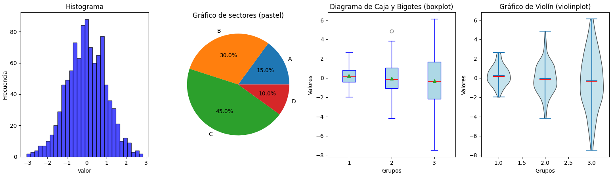
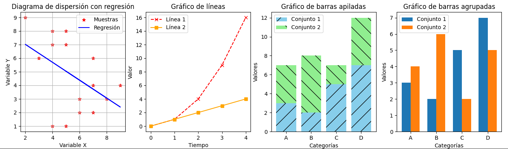
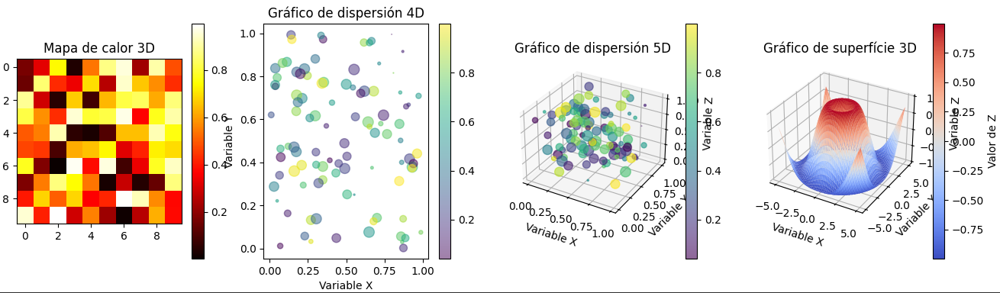
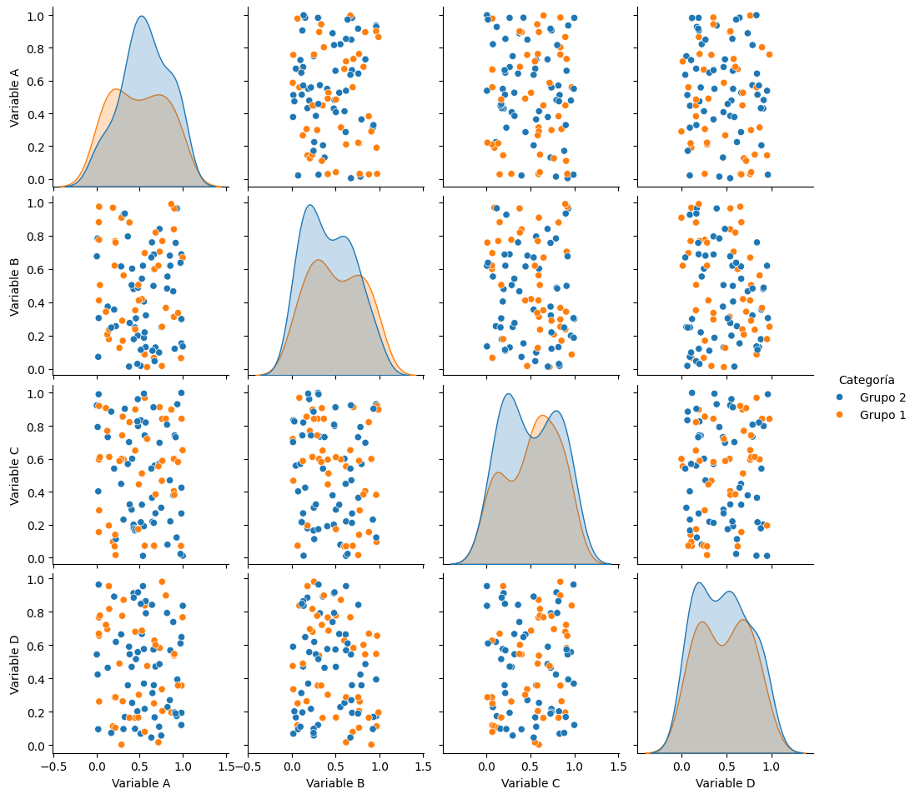

# Visualización de Datos
En esta sección se profundizará en `Matplotlib` y `Seaborn`. Veremos qué tipos de gráficos proponen, sus conceptos fundamentales, etc.

## 8.1. Introducción
`Matplotlib` propone varios tipos de gráficos según el número de variables implicadas:
- **Gráficos univariantes**: Histogramas, diagramas de barras, diagramas circulares y gráficos de líneas. Suelen usarse para descubrir distribuciones y tendencias.
- **Gráficos bivariantes**: Diagramas de dispersión, gráficos de líneas múltiples y gráficos de barras agrupadas. Útiles para relacionar dos variables.
- **Gráficos multivariantes**: Gráficos 3D, gráficos de contorno, mapas de calor y gráficos de burbujas.

Veremos cómo organizarlos con varios `subplot` y `GridSpec`, controlar los ejes, escalas y proyecciones, aplicar temas, paletas de colores y estilos, añadir títulos, etiquetas, anotaciones y leyendas y guardar gráficos con alta calidad.

`Seaborn` es una extensión de `Matplotlib` especializada en visualización estadística con estilos atractivos, integración con `Pandas` y visualizaciones complejas. Propone:
- **Gráficos univariantes**: Diagramas de distribución (histogramas, KDE), boxplots, violinplots y countplots.
- **Gráficos bivariantes**: Scatterplots, regplots, lmplots y jointplots.
- **Gráficos multivariantes**: Pairplots, heatmaps, clustermap y visualizaciones categóricas facetadas.

Veremos cómo personalizar temas, paletas y estilos con más facilidad que con `Matplotlib`, controlar títulos, etiquetas y leyendas y crear gráficos compuestos con FacetGrid, PairGrid y JointGrid.


# 8.2. Matplotlib
`Matplotlib` ofrece una **API orientada a objetos** para crear y manipular objetos como objetos como figuras y ejes. Es fácilmente integrable con `NumPy` y `Pandas` y permite **exportar los gráficos** generados en múltiples formatos (`PNG`, `PDF`, `SVG`, `EPS`, etc) con alta calidad. También ofrece **gráficos interactivos**

Además de su interfaz orientada a objetos, `Matplotlib` ofrece `PyPlot`, otra inferfaz similar a MATLAB para crear gráficos rápidamente. Un ejemplo básico de uso de `PyPlot` es:

```python
import matplotlib.pyplot as plt

plt.plot([1, 2, 3, 4], [10, 20, 25, 30])  # Mostrar datos
plt.set_title('Título del gráfico')
plt.xlabel('Eje X')
plt.ylabel('Eje Y')
plt.show()  # Mostrar gráfico
```

La interfaz orientada a objetos ofrece más control y se usa cuando queremos sub-gráficos o si se busca la modularidad. Un ejemplo de esta sería:
```python
import matplotlib.pyplot as plt

fig, ax = plt.subplots()  # Crear figura y ejes en los que dibujar gráficos (podríamos generar sub-gráficos usando argumentos
ax.plot([1, 2, 3, 4], [10, 20, 25, 30])  # Mostrar datos
ax.set_title('Título del gráfico')
ax.set_xlabel('Eje X')
ax.set_ylabel('Eje Y')
plt.show()  # Mostrar gráfico
```

Cuando se creanfiguras, ya sea con `plt.figure()` o con `plt.subplots()`, se puede elegir el tamaño de la misma utilizando el argumento `figsize`, que recibe una tupla con el ancho y alto de la figura en pulgadas. Por otro lado, la función `plt.tight_layout()` permite ajustar los márgenes y espacios para evitar que los títulos y etiquetas de la figura se superpongan.

Respecto a los **tipos de gráficos**, en las siguientes imágenes se muestran los tipos de gráficos univariantes, bivariantes y multivariantes que propone `Matplotlib` (el código para generarlos está en [actividades/seccion8_graficos_matplotlib.py](actividades/seccion8_graficos_matplotlib.py)). Es necesario precisar que para utilizar los gráficos en 3D, se necesita utilizar el módulo `mpl_toolkits.mplot3d` e inicializar un objeto `Axes3D`.





En el script [actividades/seccion8_graficos_matplotlib.py](actividades/seccion8_graficos_matplotlib.py) se utiliza `plt.subplots()` para organizar **múltiples visualizaciones** en una sola figura. Sin embargo, `Matplotlib` ofrece un control más detallado mediante:
- `plt.subplots_adjust()` y sus parámetros `wspace` y `hspace`, que controlan el espacio entre subplots.
- `GridSpec`, que permite extender subpots sobre múltiples columnas o filas.

Los **ejes** es donde mostramos los gráficos y ofrecen varios elementos configurables, como:
- `set_xlim()` y `set_ylim()` para establecer los números mínimos y máximos de cada eje. Otra opción es `margins()`, que añade un margen alrededor de los datos mostrados sin necesidad de especificar los límites manualmente.
- `set_xscale()` y `set_xscale()` para establecer la escala (linear, logarítmica, etc.). Algunas escalas aceptan el parámetro `linthresh`, que permite mantener una escala lineal hasta cierto punto.
- `set_xlabel()`, `set_xlabel()` y `set_title()` para ponerles etiquetas a los ejes y al gráfico. Algunos argumentos relevantes son `fontdict` para personalizar la fuente, `loc` para elegir la posición, `pad` para distanciarlo de la gráfica, etc. También se pueden utilizar **regular expressions** para utilizar expresiones matemáticas en **LaTeX**.
- `set_xticks()`, `set_yticks()`, `set_xticklabels()` y `set_yticklabels()` para elegir dónde aparecen las marcas de los ejes y su contenido.
- `legend()` añade una leyenda que utiliza los valores de `label` de cada elemento añadido a la gráfica. También se puede personalizar su posición con `loc`, en cuántas columnas se muestra con `ncol`, su tamaño con `fontsize`, si queremos borde con `frameon`, su título con `title`, etc.

Para **personalizar** `Matplotlib` podemos utilizar:
- `plt.style.use()`, que permite elegir entre distintos temas, como `classic` (tradicional y menos estilizado), `ggplot2` (inspirado en R, moderno y limpio), el `seaborn` (suave y atraactivo), el `dark_background` (fondo oscuro) o el `fivethirtyeight` (inspirado en *FiveThirtyEight*, para un estilo periodístico y profesional). Más estilos junto con una visualización de todos ellos puede encontrarse en la [documentación oficial](https://matplotlib.org/stable/gallery/style_sheets/style_sheets_reference.html).
- `rcParams` permite modificar todos los parámetros de los estilos (colores, tamaño de fuente, tipos de líneas, etc.).
- Los **argumentos de las funciones** para generar gráficos suelen ofrecer parámetros para cambiar el tipo de línea, su grosor, su color, etc. Respecto a los **colores**, se pueden utilizar colores predefinidos (`red`, `blue`, `purple`, etc.) o escoger valores RGB o RGBA con una tupla de floats o con códigos hexadecimales. También podemos utilizar distintos mapas de color, ya sea de los [predefinidos](https://matplotlib.org/stable/users/explain/colors/colormaps.html) o generando uno personalizado con `LinearSegmentedColormap`.
- Utilizando `annotate()` podemos añadir texto en cualquier zona del gráfico conectado con otro punto de la gráfica con una flecha. Si sólo queremos el texto, sin la flecha, podemos utilizar `text()`. Estas funciones también soportan **regular expressions**, por lo que se pueden usar fórmulas y símbolos en formato **LaTeX**.

Para guardar los gráficos generados, se utiliza `fig.savefig('grafico.png', dpi=300)` (72 dpi es suficiente para visualizaciones en pantalla, 300 es común para impresiones de alta calidad). Utilizar formatos vectoriales como SVG o PDF es mejor si los gráficos van a incluirse en documentos. Otros argumentos útiles son:
- `metadata`, para incluir un título o un autor en los metadatos de la imagen generada.
- `bbox_inches`, a la que se puede asignar `tight` para minimizar el espacio en blanco alrededor del gráfico.
- `transparent` acepta valores booleanos para guardar los gráficos con un fondo transparente.

`Matplotlib` ofrece opciones de gráficos más avanzados y complicados. Para más detalles sobre ellos, visita la [documentación oficial](https://matplotlib.org/stable/gallery/index.html).


# 8.3. Seaborn
`Seaborn` está construida sobre `Matplotlib`, pero ofrece una mejor integración con `NumPy` y `Pandas` y se centra más en **gráficos estadísticos** así como en mejorar el **estilo y la estética**. Puedes ver los gráficos que permite generar en su [galería oficial](https://seaborn.pydata.org/examples/index.html).

Una diferencia con `Matplotlib` es que `Seaborn` ofrece una serie de **datasets integrados**. Se puede obtener una lista de estos con `get_dataset_names()` y cargar el dataset que desees utilizando `load_dataset()`, lo que permite practicar distintos tipos de visualización. Algunos de ellos son `tips`, `iris`, `penguins`, `flights` y `diamonds`. También es posible cargar CSVs propios con `Pandas` utilizando `read_csv()`.

Las principales gráficas disponibles en `Seaborn` son:
- Los **histogramas** (ideales para mostrar **distribuciones**). A diferencia que con `Matplotlib`, en `Seaborn` tienen la opción de utilizar KDE (*Kernel Density Estimation*) para generar una **estimación suave** de la distribución.
- Gráficos de **dispersión y** de **líneas** para **datos relacionales**. Las líneas son especialmente útiles con series temporales.
- ***Box plot***, ***violin plot***, ***bar plot*** y ***strip plot*** para **datos categóricos**, para ver cómo varía una variable numérica en función de una categórica. Muy útiles para visualizar medianas, medias, cuartiles y valores atípicos o *outliers*.
- El `regplot` y el `lmplot` permiten añadir una línea de **regresión y** un intervalo de **confianza**.
- El `jointplot` muestra al mismo tiempo las **distribuciones univariante y bivariante** de dos variables.
- Las **facetas y grids** crean **gráficos de múltiples subgrupos de datos**, facilitando la comparación entre categorías. `catplot` y `relplot` crean gráficos complejos.


Otro tipo de visualización son los **pares de gráficos** o *pairplots*, que consisten en combinar múltiples variables (4 en el ejemplo) y representar un gráfico de dispersión para cada posible combinación de variables, generando una matriz de gráficos. La **diagonal** de dicha matriz suele ser un histograma que represente la distribución de valores de cada variable. `Seaborn` permite utilizar una **variable categórica** para colorear los puntos, lo que puede ser útil si las muestras de cada variable pertenecen a categorías diferenciadas. Aquí se muestran ejemplos de ambos casos (el código también está en [actividades/seccion8_graficos_seaborn.py](actividades/seccion8_graficos_seaborn.py)):



Para **mostrar y guardar los gráficos** generados, se utilizan las mismas funciones que en `Matplotlib`. Es decir, `plt.show()` y `plt.savefig()`. Los **parámetros de estilo** y personalización también son comunes, lo que permite mantener un estilo consistente entre ambos módulos. Si se crearon **varios ejes y subplots** con `Matplotlib`, las funciones gráficas de `Seaborn` aceptan el parámetro `ax` para especificar en qué eje deben mostrarse.

# TODO: crear script que muestre todas las funciones (esperar a secciones univariante, bivariante y multivariante?)
